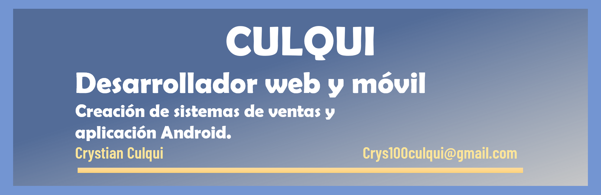

#  Bienvenid@ al GitHub de Culqui

Me especializo en desarrollar sistemas web usando tecnologías como php, python, entre otros. Asimismo, crear app android con Android Studio y muy pronto en Unity Hub.

## Tecnologías

<!-- BEGIN YOUTUBE-CARDS -->
<!-- END YOUTUBE-CARDS -->

